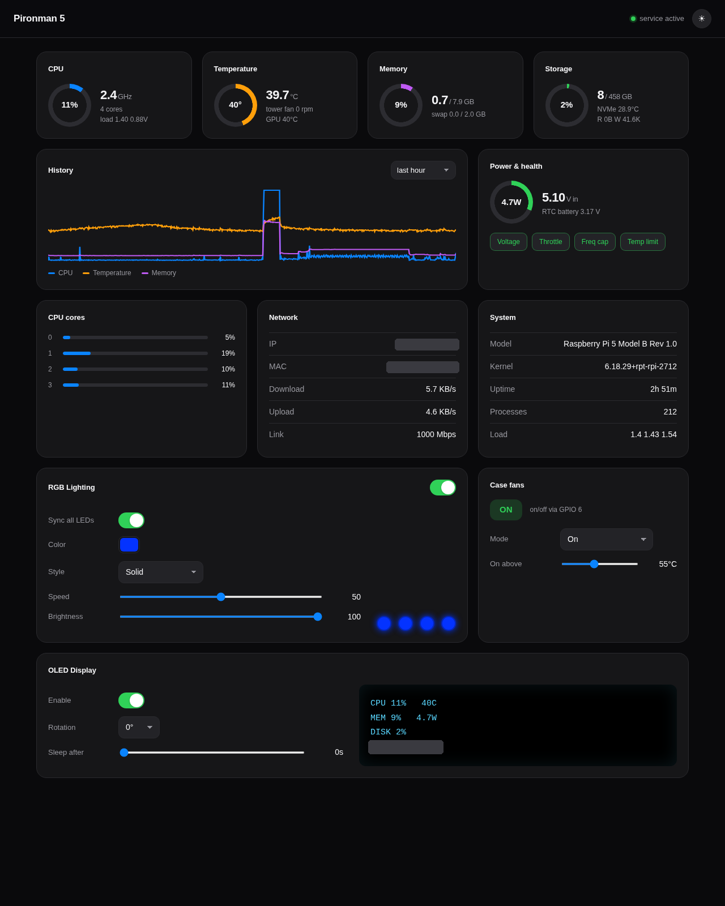

# Pironman 5

A single-device service for the Pironman 5 case on a Raspberry Pi 5. It drives
the on-board hardware, serves a live web dashboard, and keeps a lightweight
metrics history, all from one Python package with one config file.



## Features

- **Live metrics** over a WebSocket: per-core and total CPU load, frequency,
  temperature and core voltage; memory and swap; storage usage, NVMe temperature
  and disk IO; network throughput, addresses and link speed; board power draw,
  input and RTC-battery voltage, and throttle / under-voltage status; plus model,
  kernel, uptime and load average.
- **Hardware control** from the dashboard:
  - WS2812 RGB strip with solid, breathing, flow, rainbow and hue-cycle effects,
    synced across all LEDs or set per LED
  - Case fans with off / on / above-temperature modes
  - SSD1306 OLED status screen (CPU, temperature, memory, power, IP) with a
    sleep timeout
  - Light and dark themes
- **History** stored in SQLite with configurable retention, charted with hover
  read-out in the UI.
- **One config file**, validated, editable live from the dashboard or the CLI.
  The dashboard always reflects the running hardware state.
- **Mock mode** so the whole service and UI run on a laptop without any hardware.

## Hardware

| Subsystem     | Interface            | Notes                                       |
|---------------|----------------------|---------------------------------------------|
| OLED 0.96"    | I2C `0x3C` (bus 1)   | SSD1306 128x64                              |
| RGB strip     | SPI `/dev/spidev0.0` | 4x WS2812B                                  |
| Case fans     | GPIO pin 6           | on/off DC fans (no tachometer)              |
| CPU tower fan | Pi fan header (sysfs)| 4-wire PWM, firmware-managed, RPM read-only |

The CPU tower fan is controlled by the Pi 5 firmware thermal governor; this
service only reports its speed. The power button keeps its firmware default
behaviour and is not driven by this service.

## Quick start

### On the Raspberry Pi 5

```bash
git clone https://github.com/annoyedmilk/pironman5.git
cd pironman5
sudo ./deploy/install.sh
```

The installer creates a dedicated `pironman5` service user, installs the package
into a virtualenv under `/opt/pironman5`, enables SPI/I2C, installs the
device-tree overlay, udev rules and systemd unit, and starts the service. Open
`http://<your-pi>:34001` for the dashboard. A reboot is recommended so the
overlays take effect.

### On a development machine (no hardware)

```bash
uv venv
uv pip install -e ".[dev]"
uv run pironman5 run --mock
```

Then open `http://localhost:34001`. Mock mode keeps full driver behaviour and
state but performs no real IO, so the dashboard, RGB effects preview and OLED
preview all work.

## CLI

```bash
pironman5 run [--mock] [--config PATH]     # start the service
pironman5 status                           # print a metrics snapshot as JSON
pironman5 config                           # print the current config
pironman5 config --set rgb.color '#ff0000' # set a value and save
pironman5 version
```

## Configuration

Config is a single JSON file. By default it lives at
`~/.config/pironman5/config.json`; the service unit points it at
`/etc/pironman5/config.json`. Override with `--config` or the
`PIRONMAN5_CONFIG` environment variable.

Sections: `system`, `rgb`, `fan`, `oled`, `history`, `web`. Every value is
validated and clamped on load and on every change, so a bad edit cannot break
the service. Changes made through the dashboard are applied to the running
hardware immediately and persisted.

## HTTP API

All endpoints are under `/api/v1`:

| Method | Path                      | Purpose                              |
|--------|---------------------------|--------------------------------------|
| GET    | `/status`                 | one-shot metrics and hardware state  |
| WS     | `/stream`                 | live metrics frames                  |
| GET    | `/history?range=1h`       | history samples for charts           |
| GET    | `/config`                 | current config                       |
| PATCH  | `/config`                 | merge, validate and apply a change   |

## Development

```bash
uv pip install -e ".[dev]"
uv run pytest   # full suite runs in mock mode, no hardware required
uv run ruff check .
```

## Project layout

```
pironman5/
  cli.py            command-line entry point
  config.py         dataclass schema, validation and JSON persistence
  core.py           orchestrator: metrics loop, workers, live config, broadcast
  metrics/          system metrics collection
  history/          SQLite time-series store
  hardware/         fan, rgb, oled, gpio (each with a mock fallback)
  web/              FastAPI app, REST + WebSocket API, static dashboard
deploy/             systemd unit, sudoers, udev rules, overlay, installer
tests/              pytest suite
```

## License

MIT. See [LICENSE](LICENSE).
